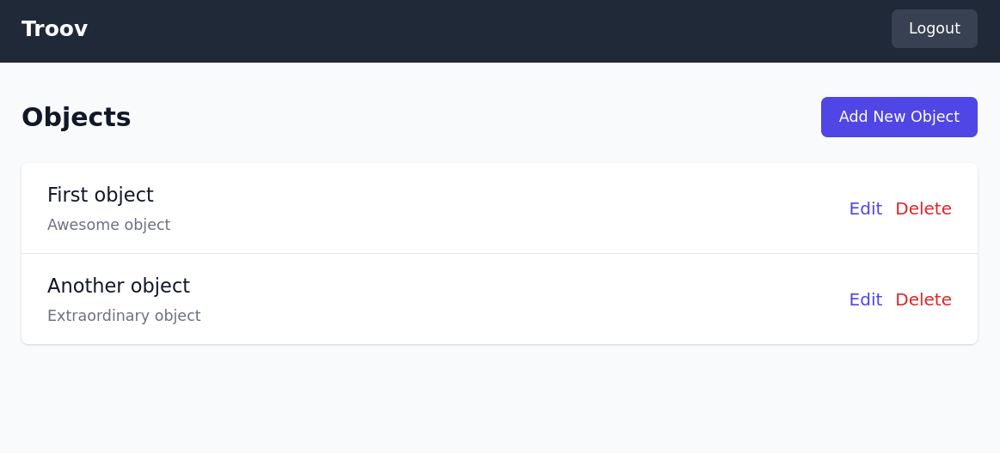

# Troov

Troov is a web application that allows users to manage objects with functionalities to create, read, update, and delete (CRUD) them.



## Usage

- Access the application at `http://localhost:3000`
- Register with an email and password to start managing your objects.

## Features

- User registration and authentication
- Add, edit, and delete objects
- View a list of all objects

## Stack

- **Frontend:** Nuxt.js, Typescript, Tailwind, CSS
- **Backend:** Node.js, Express, JavaScript, MongoDB (via Mongoose), bcryptjs, JSON Web Tokens (JWT)

## Installation

### Environment Setup

You can use nix and direnv to setup the environment:
```bash
cd troov && direnv allow
```

Else you need to install the following dependencies manually:
```bash
node v23.2.0
pnpm 9.15.0
```

### Backend Setup

1. Navigate to the backend directory, create a `.env` file and install node packages:
   ```bash
   cd backend &&
   cp .env.example .env &&
   pnpm install
   ```

2. Run the MongoDB container and start the backend server:
   ```bash
   docker-compose up -d
   pnpm run dev
   ```

> Please note: You must have docker and docker-compose installed on your system to run the MongoDB container.

### Frontend Setup

1. Navigate to the frontend directory and install node packages:
   ```bash
   cd frontend &&
   pnpm install
   ```

2. Start the frontend server:
   ```bash
   pnpm run dev
   ```

## License

This project is licensed under the MIT License.
